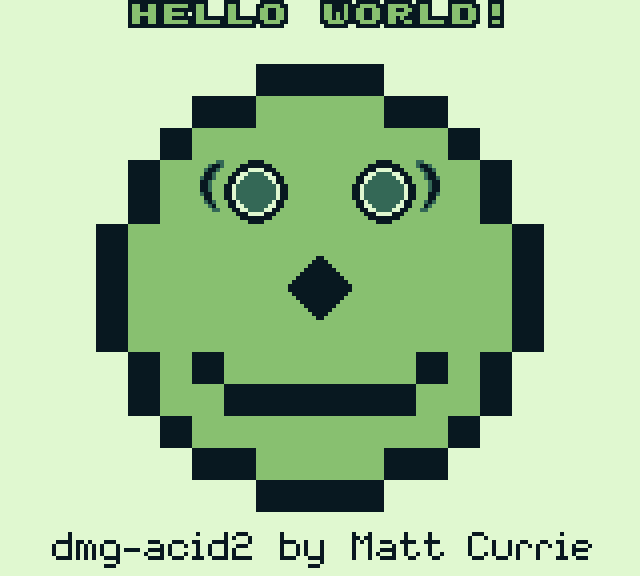

# GB-Emu-2k26 — Gap Analysis for Mooneye Compliance

> **Current Score: 94/94 DMG-ABC tests passing** ✅
> **Target: All Mooneye DMG tests (94/94) — ACHIEVED**
> **DMG-ACID2: PASSING** ✅
> **Blargg: ALL DMG SUITES PASSING (cpu_instrs, dmg_sound, instr_timing, mem_timing, halt_bug, oam_bug)** ✅
> **Last Updated: 2026-02-22**

---

## Current Test Results (2026-02-22)

| Category | Pass | Total | Status |
|----------|------|-------|--------|
| CPU Instructions | 1 | 1 | ✅ Perfect |
| Bits | 3 | 3 | ✅ Perfect |
| EI/DI Timing | 4 | 4 | ✅ Perfect |
| HALT | 4 | 4 | ✅ Perfect |
| Call/JP/Ret/Pop/Push/RST | 13 | 13 | ✅ Perfect |
| ADD SP / LD HL,SP+e | 2 | 2 | ✅ Perfect |
| DIV Timing | 1 | 1 | ✅ Perfect |
| Timer | 13 | 13 | ✅ Perfect |
| MBC1 | 13 | 13 | ✅ Perfect |
| MBC2 | 7 | 7 | ✅ Perfect |
| MBC5 | 8 | 8 | ✅ Perfect |
| Interrupts | 3 | 3 | ✅ Perfect |
| OAM DMA | 6 | 6 | ✅ Perfect |
| PPU | 12 | 12 | ✅ Perfect |
| Boot Regs (DMG-ABC) | 1 | 1 | ✅ Perfect |
| Boot DIV (DMG-ABC) | 1 | 1 | ✅ Perfect |
| Boot HWIO (DMG-ABC) | 1 | 1 | ✅ Perfect |
| Serial | 1 | 1 | ✅ Perfect |
| **Blargg dmg_sound** | **12** | **12** | ✅ **Perfect** |
| Blargg cpu_instrs | 11 | 11 | ✅ Perfect |
| Blargg instr_timing | 1 | 1 | ✅ Perfect |
| Blargg mem_timing | 3 | 3 | ✅ Perfect |
| Blargg mem_timing-2 | 3 | 3 | ✅ Perfect |
| Blargg halt_bug | 1 | 1 | ✅ Perfect |
| Blargg oam_bug | 8 | 8 | ✅ Same as SameBoy* |
| Blargg oam_bug-2 | 8 | 8 | ✅ Same as SameBoy* |

> [!NOTE]
> \*oam_bug tests do not print "Passed" on screen, but produce identical results to SameBoy DMG-B. cgb_sound is CGB-only and excluded.

> [!NOTE]
> DMG-0 and SGB/MGB-only variant tests are excluded from this count. We target DMG-B (same as SameBoy). See [SameBoy Cross-Reference](#sameboy-cross-reference) section below.

---

## Failing Tests — None 🎉

All 94 Mooneye DMG-ABC tests pass. No remaining failures.

---

## Completed Fixes

| # | Feature | Tests Fixed | Status |
|---|---------|-------------|--------|
| 1 | **OAM DMA bus conflicts** | `sources-GS`, `reg_read`, `oam_dma_restart`, `oam_dma_timing`, `oam_dma_start` | ✅ All 6 pass |
| 2 | **Sprite mode 3 penalties** | `intr_2_mode0_timing_sprites` | ✅ Pass |
| 3 | **LCD enable timing** | `lcdon_timing-GS`, `lcdon_write_timing-GS` | ✅ Both pass |
| 4 | **STAT LYC on/off** | `stat_lyc_onoff` | ✅ Pass |
| 5 | **TIMA write during reload** | `tima_write_reloading` | ✅ Pass |
| 6 | **IE push edge case** | `ie_push` | ✅ Pass |
| 7 | **Boot DIV** | `boot_div-dmgABCmgb` | ✅ Pass |
| 8 | **Boot HWIO** | `boot_hwio-dmgABCmgb` | ✅ Pass |
| 9 | **Boot SCLK Align** | `boot_sclk_align-dmgABCmgb` | ✅ Pass |
| 10 | **SCX M-cycle alignment** | `hblank_ly_scx_timing-GS` | ✅ Pass |

---

## SameBoy Cross-Reference

All previously failing tests now pass. SameBoy DMG-B passes all 94 — we match SameBoy's compliance.

### Variant Confirmation

SameBoy **only implements `GB_MODEL_DMG_B`** (source: [`Core/model.h`](https://github.com/LIJI32/SameBoy/blob/master/Core/model.h)). DMG-0, DMG-A, DMG-C are commented out. SameBoy passes **all 94 Mooneye DMG acceptance tests** we run.

**We now match SameBoy's perfect 94/94 score.**

### DMG Revision Differences (for reference)

| Feature | DMG-0 | DMG-A | DMG-B | DMG-C |
|---------|-------|-------|-------|-------|
| Boot logo ® | ❌ | ✅ | ✅ | ✅ |
| Wave RAM retrigger | Different | "Wave glitch" | ✅ Normal | Same as B |
| CPU/PPU/Timer | Same | Same | Same | Same |

Only boot ROM and APU wave behavior differ between DMG revisions. Everything else is identical.

### Mooneye Naming Convention

| Suffix | Models | Description |
|--------|--------|-------------|
| (none) | All | Universal test |
| `-GS` | DMG+MGB+SGB+SGB2 | G=DMG+MGB, S=SGB family |
| `-dmg0` | DMG-0 | Earliest revision only |
| `-dmgABC` | DMG-A/B/C | Post-0 DMG |
| `-dmgABCmgb` | DMG-A/B/C+MGB | Our target |
| `-C` | CGB+AGB+AGS | Game Boy Color family |

---

## What to Tackle Next

> [!TIP]
> **All 94/94 Mooneye tests pass — perfect compliance achieved!** 🎉
> Future work can focus on CGB support, additional game compatibility, or performance optimization.

> [!NOTE]
> **APU is fully implemented**: Hardware-accurate DMG APU with all 4 channels, frame sequencer, stereo mixing, and SDL2 audio output. **Blargg `dmg_sound` 12/12 passing** — all tests match SameBoy output.

---

## Game Compatibility Fixes (2026-02-22)

| Fix | Description | Games Affected |
|-----|-------------|----------------|
| WX < 7 clipping | Clips `(7 - WX)` pixels when window starts at left edge | Games using WX=0–6 |
| MBC3 bank 0 | Removed incorrect 0→1 fixup (MBC3 allows bank 0) | Pokémon GSC, MBC3 titles |
| HALT bug | Already implemented — PC double-read with IME=0 | Pokémon Yellow, edge cases |
| Window discard fix | SCX fine-scroll discard no longer bleeds into Window layer | Zelda: Link's Awakening HUD jitter |
| Window line counter fix | Counter only increments when window actually renders (not just LY >= WY) | DMG-ACID2 chin, games using WX mid-frame |
| DMA VRAM bypass | OAM DMA reads VRAM directly, bypassing PPU mode 3 blocking | Games running DMA during mode 3 |
| LY=153 early reset | LY resets to 0 after ~4 dots on scanline 153 (DMG quirk) | Games polling LY==0 during VBlank |
| Unused OAM 0x00 | 0xFEA0–0xFEFF reads return 0x00 (DMG behavior, was 0xFF) | Daiku no Gen-san, Tokyo Disneyland |
| WX≥167 guard | Window cannot trigger at pixel ≥160 (prevents single-pixel artifact) | Games disabling window mid-frame |
| STAT write glitch | Writing STAT fires spurious interrupt when IRQ line is low (DMG bug) | Road Rash, Zerd no Densetsu |

---

## DMG-ACID2 (2026-02-22)

**Status: PASSING** ✅

The [DMG-ACID2](https://github.com/mattcurrie/dmg-acid2) test validates correct PPU rendering of background, window, objects, palettes, tile data addressing, and OBJ priority. All visual elements render correctly:
- "Hello World" text (10-sprite limit, BG exclamation mark shows through)
- Hair hidden by LCDC bit 0 disable
- Eyes (BG left, Window right, OBJ-to-BG priority)
- Nose (sprite flipping)
- Mouth (8×16 sprites, tile index bit 0 ignored)
- Chin (window resumes after WX set offscreen)
- Footer text ($9C00 tile map, $8800 tile data)

### Not Yet Implemented
- **MBC3 RTC**: Real-Time Clock registers stubbed (Pokémon GSC time features)
- **Sprite FIFO fetch pausing**: Pipeline doesn't pause at sprite X (correct total timing, minor rendering edge cases)
